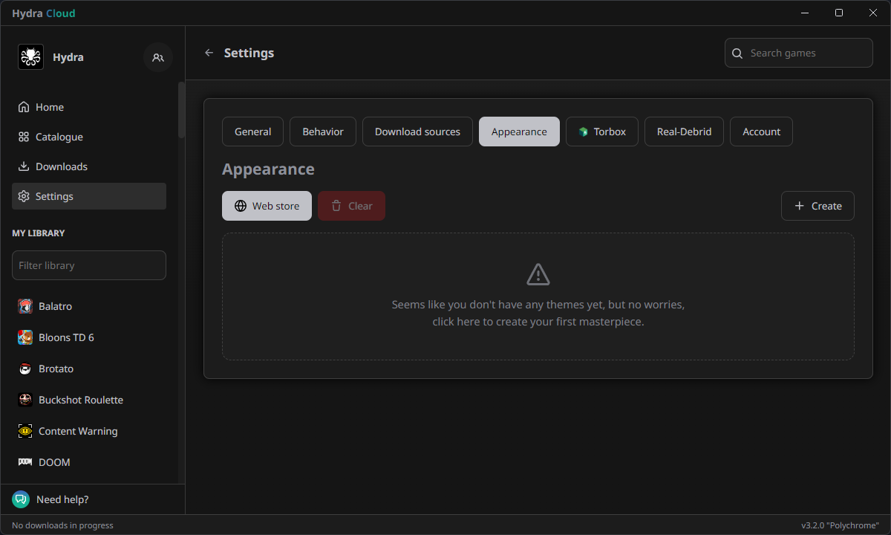
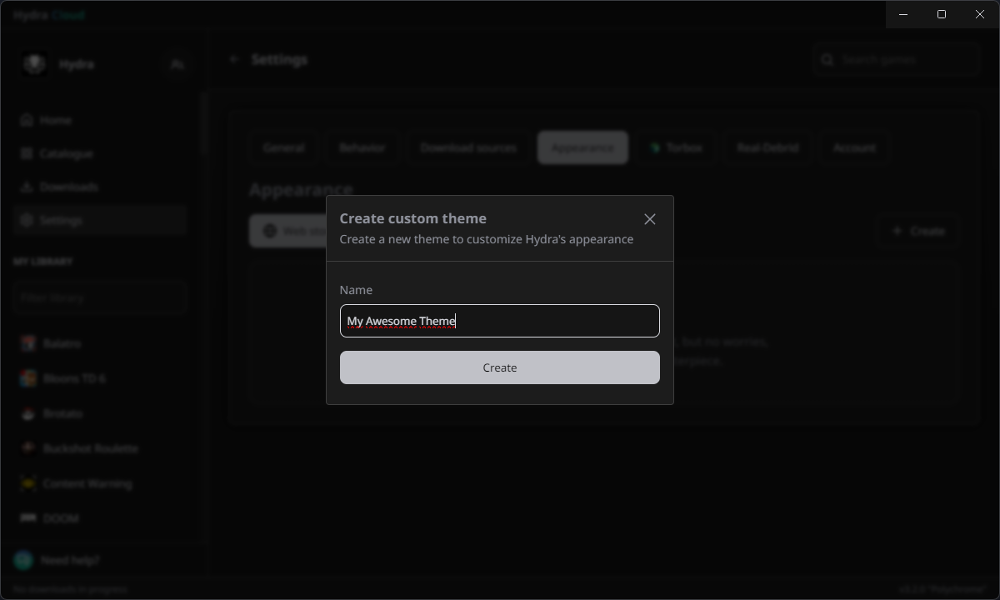
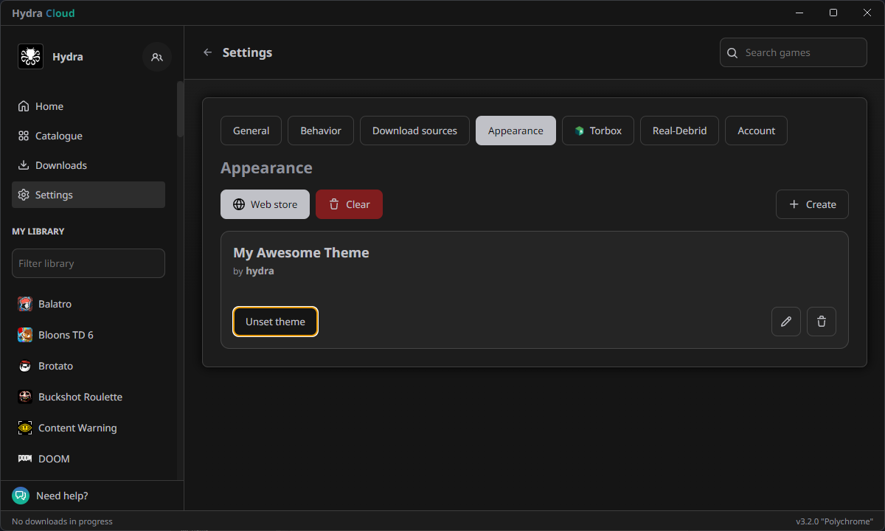
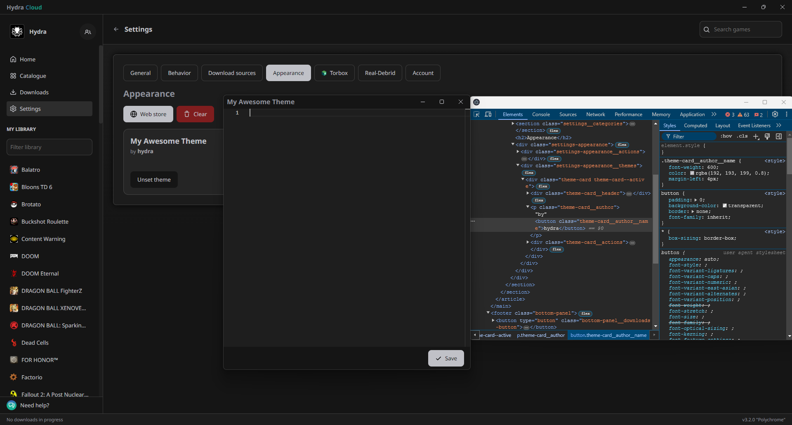
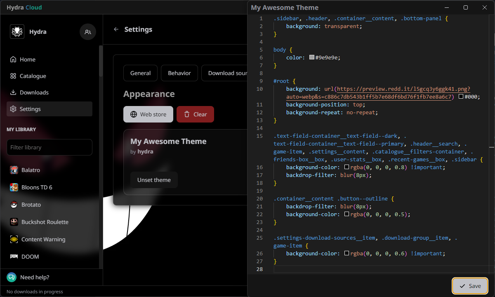
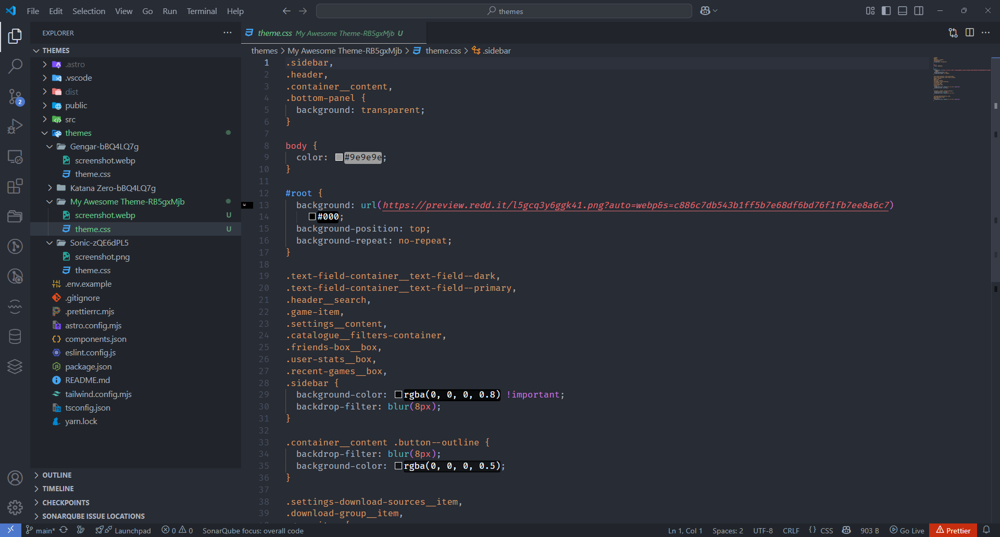
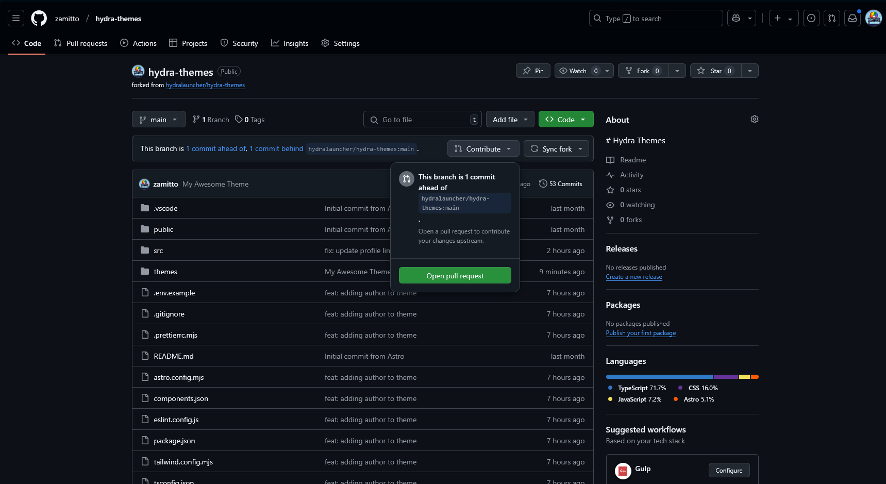

# Hydra Custom Themes

::: warning :construction: WORK IN PROGRESS
This page is a work in progress and is not yet complete.
:::

Hydra lets you add custom themes allowing you to make it looks the way you want.

## How to install a custom theme

Themes are available in our [Themes Store](https://hydrathemes.shop/). You can easily install one theme by just clicking the "Install Theme" button.


## How to create a custom theme

Go to the Appearance tab in the Settings page and click on the "Create" button.



Pick a name for your theme


Click on Set theme to make this your current active theme



Click on the Edit button to start working on it


Two windows will open. One is the theme editor, where you will write the CSS for your custom theme. The other one is the Dev Tools for the main window, where you will be able to debug and see all the current HTML and CSS to help you write your theme



And now you can make your Hydra Launcher looks however you want. For example, this is the CSS for the theme in the next screenshot:

```CSS
.sidebar,
.header,
.container__content,
.bottom-panel {
  background: transparent;
}

body {
  color: #9e9e9e;
}

#root {
  background: url(https://preview.redd.it/l5gcq3y6ggk41.png?auto=webp&s=c886c7db543b1ff5b7e68df6bd76f1fb7ee8a6c7)
    #000;
  background-position: top;
  background-repeat: no-repeat;
}

.text-field-container__text-field--dark,
.text-field-container__text-field--primary,
.header__search,
.game-item,
.settings__content,
.catalogue__filters-container,
.friends-box__box,
.user-stats__box,
.recent-games__box,
.sidebar {
  background-color: rgba(0, 0, 0, 0.8) !important;
  backdrop-filter: blur(8px);
}

.container__content .button--outline {
  backdrop-filter: blur(8px);
  background-color: rgba(0, 0, 0, 0.5);
}

.settings-download-sources__item,
.download-group__item,
.game-item {
  background-color: rgba(0, 0, 0, 0.6) !important;
}
```



## How to publish your custom theme

::: warning
For this step, you will need basic [Git](https://git-scm.com/) and [GitHub](https://docs.github.com/en/get-started/start-your-journey/about-github-and-git) knowledge.
:::

To publish your theme you need to open a Pull Request in the Hydra Themes repository.

For this, you will need to:

1. Fork the hydra-themes repository
2. Create the folder and files for your theme
3. Commit and Push your theme
4. Open a Pull Request
5. Wait for your theme to be reviewed by the mods

### Fork the hydra-themes repository

Being logged in to your GitHub account, you can go to the Hydra Themes [fork page](https://github.com/hydralauncher/hydra-themes/fork)

Create the fork and then clone it into your machine.

You can clone your fork with the git clone command: `git clone https://github.com/<github-username>/hydra-themes.git`

### Create the folder and files for your theme

Now you need to create your theme inside the project. Here I opened the project folder using Visual Studio Code, created the folder "My Awesome Theme-\<my friend code>" inside the "themes" folder and added a screenshot of the theme and the .css file containing all the code that I wrote inside the launcher.

Things to note:

- The name of the screenshot file must be `screenshot` and the extension of file the must be one of the following: `png, webp, jpg, jpeg, avif, heic, heif`.
- The extension of the css file must be `.css`.
- You must add your friend code to the folder name. Pull Requests that don't have a friend code, or that have a friend code that don't belong to you, will not be accepted.
- You must not change any other files that don't belong to your theme.



### Commit and Push your theme

1. Stage your theme files: `git add .`
2. Commit your changes: `git commit -m 'Creating my theme'`
3. Push your changes: `git push`

### Open a Pull Request

1. Go to your fork page
2. Click on "Contribute"
3. Click on "Open pull request"
4. Click on "Create pull request"



### Wait for your theme to be reviewed by the mods

The Hydra team will review your theme and check if it follows the rules of creating a theme

If everything is good, your PR will be approved and after approved, it should be available in the store in a few minutes!
